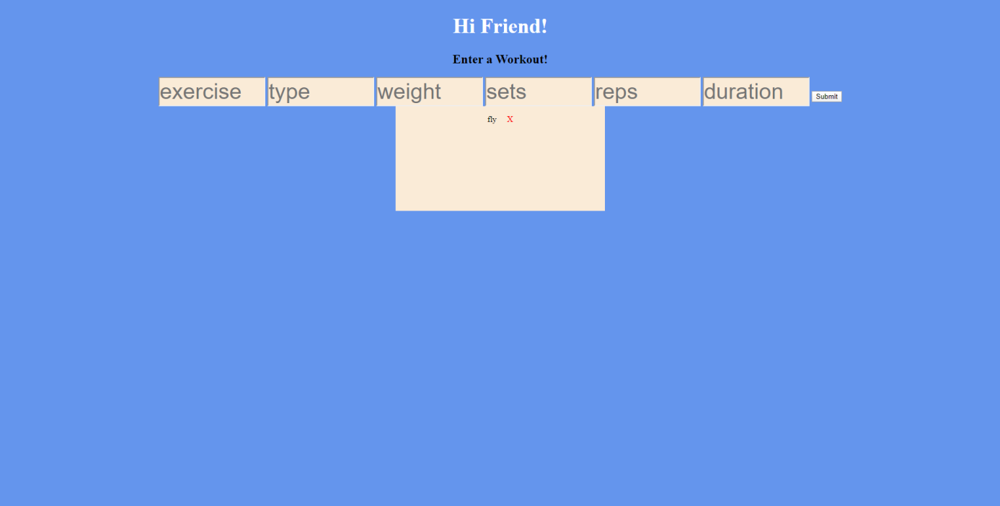

# workout-tracker

## Description
This project is used to to have a working website that shows the Burgers that you want to eat and have eatin.

This project is deployed at https://sleepy-taiga-66644.herokuapp.com/

---

## Table of Contents
*[Description](#description)

*[Installation](#installation)

*[GitHub](#github)

---

## Installation
The user will need to init and npm i to install the dependencies of express, mongojs, mongoose, and morgan.

---

## Usage for My Project
The use of this project is to make it fast and easy for users to create a list of workouts they want to keep track of.

---

## Contributors and Help
Louis Coleman

---

## Tests
There are no tests for this project

---

## GitHub

https://github.com/coleloui

No user email

---
                    
                    